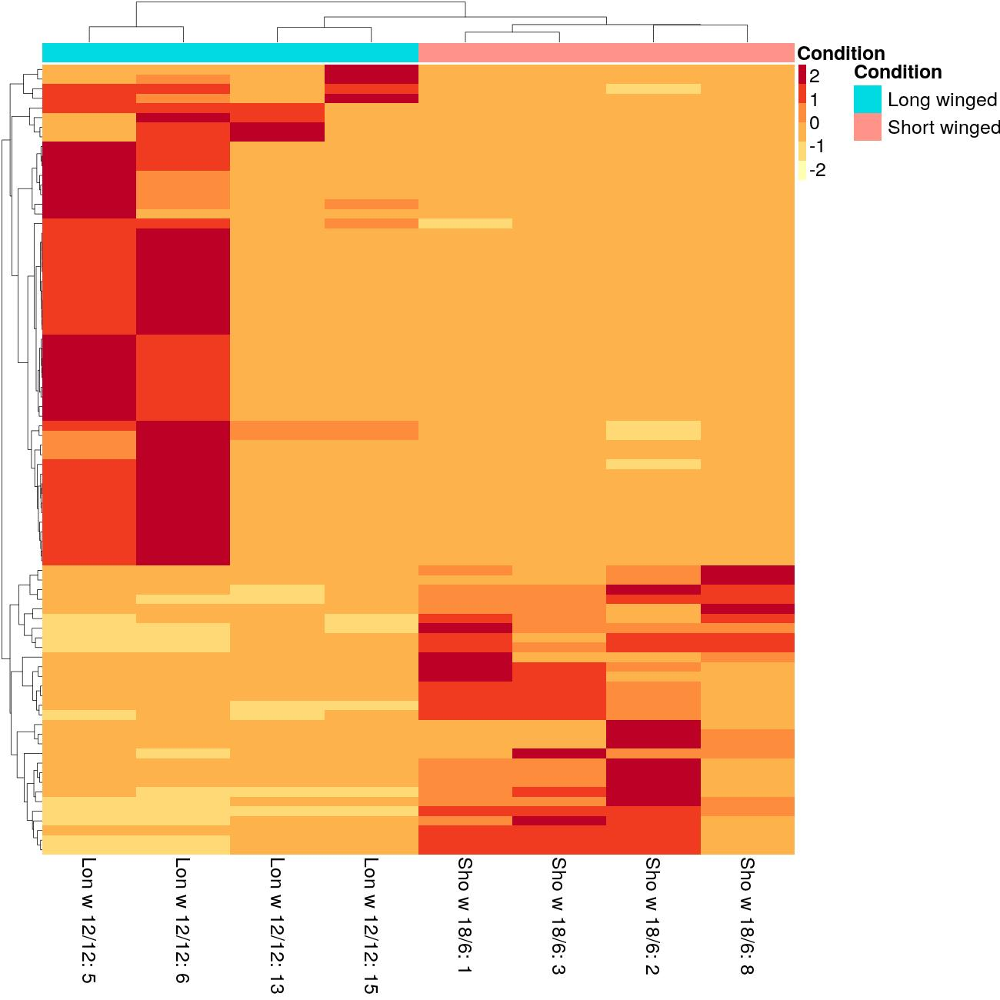

```{r setup, include = FALSE}
library(knitr)
library(tidyverse)

# Suppressing the number of chunk output lines 
# the default output hook
hook_output = knit_hooks$get('output')
# https://github.com/yihui/knitr-examples/blob/master/052-suppress-output.Rmd
knit_hooks$set(output = function(x, options) {
  if (!is.null(n <- options$out_lines)) {
    x = unlist(stringr::str_split(x, '\n'))
    if (length(x) > n) {
      # truncate the output
      x = c(head(x, n), '...\n')
    }
    x = paste(x, collapse = '\n') # paste first n lines together
  }
  hook_output(x, options)
})

# Code wrapping in chunks
# https://github.com/yihui/knitr/issues/1653
# https://bookdown.org/yihui/rmarkdown-cookbook/output-hooks.html
# the default chunk contents
hook_source = knit_hooks$get('source')
knit_hooks$set(source = function(x, options) {
  if(isTRUE(options$wrap_lines)) x = strwrap(x, 
                                             width = options$wl_width)
  hook_source(x, options)
})

# Formating output of inline R code (Haven't tested if these settings look nice)
# https://github.com/SchlossLab/new_project/blob/master/submission/manuscript.Rmd
# https://yihui.org/knitr/demo/output/#inline-output
knit_hooks$set(inline=function(x){
	print(x)
	if(is.list(x)){
		x <- unlist(x)
	}
	if(is.numeric(x)) {
		if(abs(x - round(x)) < .Machine$double.eps^0.5) {
			paste(format(x,
			             big.mark=',',
			             digits=0,
			             scientific=FALSE))
		} else {
			paste(format(x,
			             big.mark=',',
			             digits=1,
			             nsmall=1,
			             scientific=FALSE))
		}
	} else {
      paste(x)      
	}
})

# Global default options for chunks

# include R source code in the output file?
opts_chunk$set("echo" = TRUE)
# evaluate the code chunk?
opts_chunk$set("eval" = TRUE)
# preserve warnings (produced by warning()) in the output?
opts_chunk$set("warning" = TRUE)
#preserve messages emitted by message() (similar to warning)?
opts_chunk$set("message" = TRUE)

opts_chunk$set("comment" = NA)

opts_chunk$set("cache" = FALSE)
opts_chunk$set("out_lines" = 3)
opts_chunk$set("wrap_lines" = TRUE)
line_length <- 80
opts_chunk$set("wl_width" = line_length)
opts_chunk$set("fig.align" = "center")
opts_chunk$set(engine.path = list(
  python = '/opt/conda/bin/python3'
))
# whether to reformat the R code
# opts_chunk$set("tidy" = TRUE) 
# # How should the tidying done with formatR https://yihui.org/formatr/
# opts_chunk$set("tidy.opts" = list(blank = TRUE, 
#                                   width.cutoff = line_length,
#                                   comment = TRUE,
#                                   indent = 2,
#                                   brace.newline = FALSE))
```

\clearpage
# Introduction

Here is introduction to this example document. This document is written in R Studio server [@RStudioTeam2020] and running in R Docker container [@Boettiger2017].

\clearpage
# Some chapter

I prefer that 1. level headings start from a new page and try not to have heading levels higher than 2.

Here is an example Figure 1.

{width=67%}

## Here is a sub chapter

Footnotes can be inserted with a simple syntax[^foot-note]. The following Table 1 is an example.

| No   | Column 1    | Column 2 |
| ---- | ----------- | -------- |
| 1    | Some        | Data     |
| 2    | Here too    | and here |
| 3    | and finally | here     |
Table: Here is an example table.

In order to convert this Rmarkdown document to both html and pdf format, you should move this section in the YAML header:

```
  bookdown::pdf_document2:
    keep_tex: no
    latex_engine: xelatex
    # For more pandoc args see:
    # https://pandoc.org/MANUAL.html
    pandoc_args: ["--top-level-division=section",
                  "-V", "documentclass=article",
                  "-V", "linkcolor=MidnightBlue",
                  "-V", "citecolor=Aquamarine",
                  "-V", "urlcolor=NavyBlue",
                  "-V", "toccolor=NavyBlue",
                  "-V", "pagestyle=headings"]
```

above this section:

```
  bookdown::html_document2:
    highlight: tango
    theme: yeti
    split_by: none # only generate a single output page
    self_contained: TRUE
    toc: yes
    toc_float: 
      collapsed: FALSE
      smooth_scroll: TRUE
      print: FALSE
    code_folding: hide
    number_sections: TRUE
    code_download: TRUE
    pandoc_args: ["--top-level-division=section",
              "-V", "documentclass=report"]
```

but below the line with `output: `. This is quite hacky but it works for now...

[^foot-note]: Here is a foot note text.

\clearpage
# Session info

```{r}
sessionInfo()
```

\clearpage
# References
